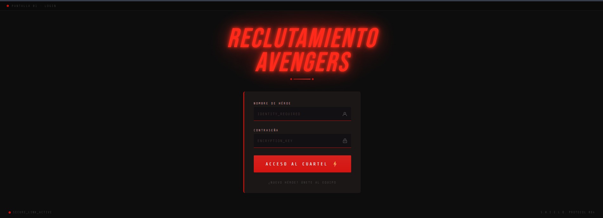
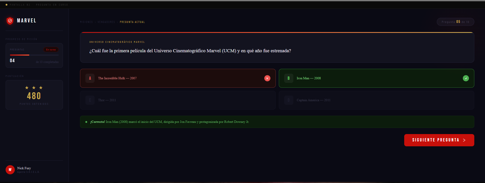

# Descricion de pantallas trivia Marvel

---

## Pantallas

### Pantalla 1 — Login (`/login`)

Página de acceso al cuartel. Punto de entrada para agentes registrados y nuevos reclutas.

#### Elementos de la interfaz

- **Título** `TRIVIA MARVEL` con efecto de brillo rojo y tipografía italizada
- **Campo de nombre de héroe** — equivalente a nombre de inicio de sesión
- **Campo de contraseña** 
- **Botón** `ACCESO DE HEROE `
- **Enlace** `¿NUEVO HÉROE? ÚNETE AL EQUIPO` para registro de nuevos usuarios

---

### Pantalla 2 — Trivia (`/quiz`)

Pantalla principal de juego. El usuario demuestra su conocimiento del universo Marvel respondiendo preguntas relacionadas a superhéroes.

#### Sidebar (panel lateral izquierdo)

| Sección | Descripción |
|---|---|
| Progreso de misión | Barra de avance visual con número de pregunta actual sobre el total |
| Puntuación acumulada | Contador de puntos en tiempo real |
| Perfil del usuario | Nombre de héroe e imagen de avatar del usuario autenticado | (deseable)

#### Tarjeta de pregunta (área principal)

- Número de pregunta (ej. `PREGUNTA 3 DE 10`)
- Texto de la pregunta destacado
- **Grid 2×2** con 4 opciones de respuesta:
  - Estado por defecto: borde neutro, fondo oscuro
  -  **Respuesta correcta:** resaltado en verde con ícono de confirmación
  -  **Respuesta incorrecta:** resaltado en rojo con ícono de error; se revela la opción correcta
- **Banner de resultado** (visible tras responder):
  - Indicador visual de acierto o fallo
  - Explicación breve de la respuesta correcta
- **Botón** `SIGUIENTE PREGUNTA →` para avanzar al siguiente ítem

---

## Modelo de Base de Datos (MongoDB)

Las preguntas se obtienen de una API externa y son enriquecidas con explicaciones generadas por IA (Claude) o alguna opcion mencionada. El modelo está diseñado para cachear ese contenido y evitar llamadas repetidas.

